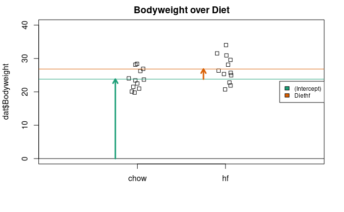
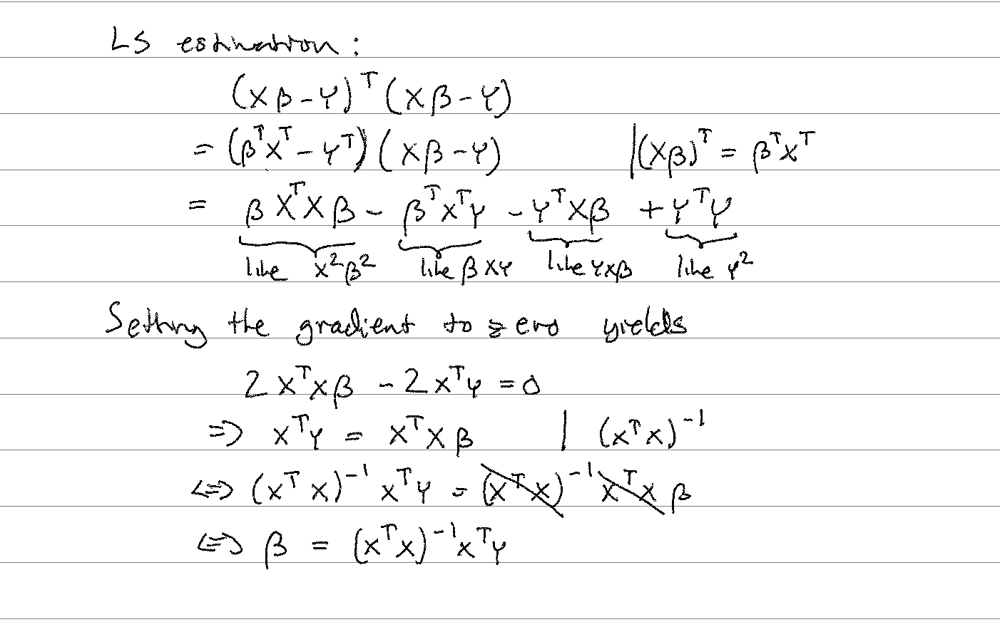

# Linear Models

Many of the models we use in data analysis can be presented using matrix algebra. We refer to these types of models as _linear models_. "Linear" here does not refer to lines, but rather to linear combinations. The representations we describe are convenient because we can write models more succinctly and we have the matrix algebra mathematical machinery to facilitate computation. In this chapter, we will describe in some detail how we use matrix algebra to represent and fit.

In this material, we focus on linear models that represent dichotomous groups: treatment versus control, for example. The effect of diet on mice weights is an example of this type of linear model. Here we describe slightly more complicated models, but continue to focus on dichotomous variables. 

As we learn about linear models, we need to remember that we are still working with random variables. This means that the estimates we obtain using linear models are also random variables. Although the mathematics is more complex, the concepts we learned in previous chapters apply here. We begin with some exercises to review the concept of random variables in the context of linear models.

#### Simple linear model for two groups

$$ 
Y_i = \beta_0 + \beta_1 x_i + \varepsilon_i, i=1,\dots,N 
$$
where 
$\varepsilon_i \sim N(0,\sigma^2)$.

Here, we now think that $x_i$ is either $0$ or $1$ (indicator variable) as we have only categorical predictors. It is also possible to have continuous/numeric $x_i$.

{width=80%}

#### {-}

Let's note that in this simple example we have
\begin{align}
\overline{Y_1} &= \beta_0\\
\overline{Y_2} &= \beta_0 + \beta_1
\end{align}

Also note that 
$$E(Y_i) = \beta_0 + \beta_1 x_i$$
because $E[\varepsilon_i] = 0$. The equation above can be used to calculate fitted values for observed $Y_i$ or predictions for new data $Y_{N+k}, k \geq 1$. 

#### {-}

we can use linear algebra to represent this model:

$$
\mathbf{Y} = \begin{pmatrix}
Y_1\\
Y_2\\
\vdots\\
Y_N
\end{pmatrix}
,
\mathbf{X} = \begin{pmatrix}
1&x_1\\
1&x_2\\
\vdots\\
1&x_N
\end{pmatrix}
,
\boldsymbol{\beta} = \begin{pmatrix}
\beta_0\\
\beta_1
\end{pmatrix} \mbox{ and }
\boldsymbol{\varepsilon} = \begin{pmatrix}
\varepsilon_1\\
\varepsilon_2\\
\vdots\\
\varepsilon_N
\end{pmatrix}
$$


as: 


$$
\,
\begin{pmatrix}
Y_1\\
Y_2\\
\vdots\\
Y_N
\end{pmatrix} = 
\begin{pmatrix}
1&x_1\\
1&x_2\\
\vdots\\
1&x_N
\end{pmatrix}
\begin{pmatrix}
\beta_0\\
\beta_1
\end{pmatrix} +
\begin{pmatrix}
\varepsilon_1\\
\varepsilon_2\\
\vdots\\
\varepsilon_N
\end{pmatrix}
$$

or simply: 

$$
\mathbf{Y}=\mathbf{X}\boldsymbol{\beta}+\boldsymbol{\varepsilon}
$$

The design matrix is the matrix $\mathbf{X}$.

#### Definition of Linear Model

For arbitrary number of predictors we can write the linear model as follows
$$ 
Y_i = \beta_0 + \beta_1 x_{i1} + \ldots + \beta_p x_{ip} + \varepsilon_i, i=1,\dots,N 
$$
where 
$\varepsilon_i \sim N(0,\sigma^2)$.

That would allow using more than one group in model. More generally we could have multiple predictor variables in the model.

Using matrix notation we have the same as before
$$
\mathbf{Y}=\mathbf{X}\boldsymbol{\beta}+\boldsymbol{\varepsilon},
$$
where adding more predictors to the equation requires us to add more columns to $\mathbf{X}$ and more elements to vector $\mathbf{\beta}$.

#### Solving the beta's

How could we solve the $\beta$'s?

We will minimize the sum of squares of errors to obtain $\beta$'s. That is called Least Squares estimation.
$$
\sum_{i=1}^N \varepsilon_i^2 = \sum_{i=1}^N (Y_i - \beta_0 + \beta_1 x_{i1} + \ldots + \beta_p x_{ip})^2
$$


It is handy to write that using matrix notation
$$
(X\beta-Y)^T (X\beta-Y)
$$
or by noting $r =X\beta-Y$
$$
r^T r
$$


## The Mathematics Behind lm()

Before we use our shortcut for running linear models, `lm`, we want to review what will happen internally. Inside of `lm`, we will form the design matrix $\mathbf{X}$ and calculate the $\boldsymbol{\beta}$, which minimizes the sum of squares using the previously described formula. The formula for this solution is:

$$ \hat{\boldsymbol{\beta}} = (\mathbf{X}^\top \mathbf{X})^{-1} \mathbf{X}^\top \mathbf{Y} $$

### More Mathematics Behind lm()



#### The mouse diet example

We will demonstrate how to analyze the high fat diet data using linear models instead of directly applying a t-test. We will demonstrate how ultimately these two approaches are equivalent. 

We start by reading in the data and creating a quick stripchart:

```{r,echo=FALSE}
url <- "https://raw.githubusercontent.com/genomicsclass/dagdata/master/inst/extdata/femaleMiceWeights.csv"
filename <- "femaleMiceWeights.csv"
library(downloader)
if (!file.exists(filename)) download(url, filename)
```

```{r,echo=FALSE}
set.seed(1) #same jitter in stripchart
```

```{r bodyweight_by_diet_stripchart, fig.cap="Mice bodyweights stratified by diet.", out.width="50%"}
dat <- read.csv("femaleMiceWeights.csv") ##previously downloaded
stripchart(dat$Bodyweight ~ dat$Diet, vertical=TRUE, method="jitter",
           main="Bodyweight over Diet")
```

#### {-}
We can see that the high fat diet group appears to have higher weights on average, although there is overlap between the two samples.

For demonstration purposes, we will build the design matrix $\mathbf{X}$ using the formula `~ Diet`. The group with the 1's in the second column is determined by the level of `Diet` which comes second; that is, the non-reference level. 

```{r}
levels(dat$Diet)
X <- model.matrix(~ Diet, data=dat)
head(X)
```

#### {-}

We can calculate this in R using our matrix multiplication operator `%*%`, the inverse function `solve`, and the transpose function `t`.


```{r}
Y <- dat$Bodyweight
X <- model.matrix(~ Diet, data=dat)
solve(t(X) %*% X) %*% t(X) %*% Y
```

These coefficients are the average of the control group and the difference of the averages:


```{r}
s <- split(dat$Bodyweight, dat$Diet)
mean(s[["chow"]])
mean(s[["hf"]]) - mean(s[["chow"]])
```

#### {-}

Finally, we use our shortcut, `lm`, to run the linear model:

```{r}
fit <- lm(Bodyweight ~ Diet, data=dat)
summary(fit)
(coefs <- coef(fit))
```

#### Examining the coefficients

The following plot provides a visualization of the meaning of the coefficients with colored arrows (code not shown):

```{r parameter_estimate_illustration, fig.cap="Estimated linear model coefficients for bodyweight data illustrated with arrows.",echo=FALSE, out.width="50%"}
stripchart(dat$Bodyweight ~ dat$Diet, vertical=TRUE, method="jitter",
           main="Bodyweight over Diet", ylim=c(0,40), xlim=c(0,3))
a <- -0.25
lgth <- .1
library(RColorBrewer)
cols <- brewer.pal(3,"Dark2")
abline(h=0)
arrows(1+a,0,1+a,coefs[1],lwd=3,col=cols[1],length=lgth)
abline(h=coefs[1],col=cols[1])
arrows(2+a,coefs[1],2+a,coefs[1]+coefs[2],lwd=3,col=cols[2],length=lgth)
abline(h=coefs[1]+coefs[2],col=cols[2])
legend("right",names(coefs),fill=cols,cex=.75,bg="white")
```

#### {-}

To make a connection with material presented earlier, this simple linear model is actually giving us the same result (the t-statistic and p-value) for the difference as a specific kind of t-test. This is the t-test between two groups with the assumption that the population standard deviation is the same for both groups. This was encoded into our linear model when we assumed that the errors $\boldsymbol{\varepsilon}$ were all equally distributed.

Although in this case the linear model is equivalent to a t-test, we will soon explore more complicated designs, where the linear model is a useful extension. Below we demonstrate that one does in fact get the exact same results:

#### {-}

Our `lm` estimates were:

```{r}
summary(fit)$coefficients
```

And the t-statistic  is the same:

```{r}
ttest <- t.test(s[["hf"]], s[["chow"]], var.equal=TRUE)
summary(fit)$coefficients[2,3]
ttest$statistic
```
